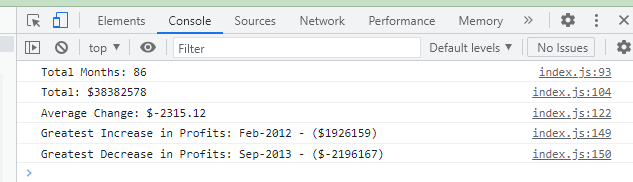

# Console-Finance

## Code repository:


Deployed application:


<br>

### Description
For this project, I was given a set of financial data and asked to create a report on the company's performance. The report needed to include the following information:

- The total number of months included in the dataset
- The net total amount of Profit/Losses over the entire period
- The average of the changes in "Profit/Losses" over the entire period
- The greatest increase in profits (date and amount) over the entire period
- The greatest decrease in losses (date and amount) over the entire period

<br>

## Console Log Screenshot



<br>

## Code examples

A simple section of code to log the net total profits/losses.

``` let totalsum = 0;
    for (var i = 0; i < finances.length; i++) {
        totalsum = totalsum + finances[i][1];
    }

    console.log("Total: $" + totalsum)
```

A more complex function to log the average change.

``` function findAverageChange() {
    let changes = [];
    
    for (var i = 1; i < finances.length; i++) {
        changes.push (finances[i][1] - finances[i-1][1]) 
    }
    let sum = changes.reduce((a,b)=>{
        return a+b
    })
    let average = sum / changes.length
    average = average.toFixed(2)
    console.log(`Average Change: $${average}`)
}

findAverageChange()
```
<br>

## Technologies used


<br>

## License

MIT License

Copyright (c) 2022 Jonathan Johnson

Permission is hereby granted, free of charge, to any person obtaining a copy
of this software and associated documentation files (the "Software"), to deal
in the Software without restriction, including without limitation the rights
to use, copy, modify, merge, publish, distribute, sublicense, and/or sell
copies of the Software, and to permit persons to whom the Software is
furnished to do so, subject to the following conditions:

The above copyright notice and this permission notice shall be included in all
copies or substantial portions of the Software.

THE SOFTWARE IS PROVIDED "AS IS", WITHOUT WARRANTY OF ANY KIND, EXPRESS OR
IMPLIED, INCLUDING BUT NOT LIMITED TO THE WARRANTIES OF MERCHANTABILITY,
FITNESS FOR A PARTICULAR PURPOSE AND NONINFRINGEMENT. IN NO EVENT SHALL THE
AUTHORS OR COPYRIGHT HOLDERS BE LIABLE FOR ANY CLAIM, DAMAGES OR OTHER
LIABILITY, WHETHER IN AN ACTION OF CONTRACT, TORT OR OTHERWISE, ARISING FROM,
OUT OF OR IN CONNECTION WITH THE SOFTWARE OR THE USE OR OTHER DEALINGS IN THE
SOFTWARE.